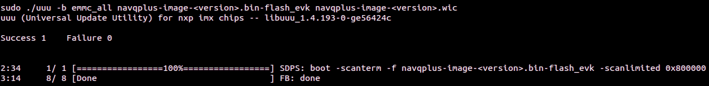

# NavQPlus set up for CogniPilot with ROS 2 Humble

## Before starting
!!! important
    **The NavQPlus Ubuntu 22.04 with ROS 2 Humble image uses CycloneDDS by default.[^1][^3]**

!!! attention
    **These directions are written for someone with experience with embedded Linux and basic embedded computers.**

## Step-by-step
 
1. Download the **[pre-built latest Ubuntu 22.04 with ROS2 Humble and CycloneDDS image](https://github.com/rudislabs/navqplus-images/releases/latest)**, exact instructions for that release image are included on the [release documentation](https://github.com/rudislabs/navqplus-images/releases/latest) to use in conjunction with this guide.
2. Extract the image `navqplus-image-<version>.wic` from the compressed downloaded file `navqplus-image-<version>.wic.zstd` and flash it to the [EMMC](#flashing-the-emmc), [exact copy and paste instructions](https://github.com/rudislabs/navqplus-images/releases/latest) are on the release page.
3. [Log in for the first time](#log-in-for-the-first-time) by connecting to another computer using the [USB to UART adatper](#usb-to-uart-adapter), [ethernet adapter](#ethernet) or [centermost (USB 2) USB-C® port](#usb-c-gadget-ethernet).[^2]
4. [Configure Wifi, System User Name and Password.](#configuring-wifi-system-hostname-username-or-password)
5. [Connect to NavQPlus over WiFi](#connecting-to-navqplus-over-wifi)
6. [Install CogniPilot by running the included installer script.](#install-cognipilot-through-included-script)

## Flashing the eMMC
To flash the eMMC on the NavQPlus use the [uuu](https://github.com/rudislabs/navqplus-images/releases/latest) tool as part of the downloadable assests from the release.

Once `uuu` has downloaded make sure to set it as executable:

```bash
chmod a+x uuu
```

find the [boot switches](#boot-switches) on the NavQPlus and flip them to the "Flash" mode.

Then, connect NavQPlus to the computer with the downloaded release using the leftmost (USB 1) USB-C® port and the two flash status lights should light up as shown in the image. 


Run the following command to make sure that the NavQPlus is recognized by `uuu`:

```bash
./uuu -lsusb
```


If it shows that a device is connected, continue to flashing. To flash the board, use the general command below or [copy and paste the specific command](https://github.com/rudislabs/navqplus-images/releases/latest) from the release:

```bash
sudo ./uuu -b emmc_all navqplus-image-<version>.bin-flash_evk navqplus-image-<version>.wic
```

Once this process has finished, make sure that the flash was successfull by comparing to the image below. If so, configure the [boot switches](#boot-switches) to boot from eMMC.




## Boot Switches

NavQPlus can be configured to boot from either SD card or eMMC. It also has a flash mode that allows for to flashing either the eMMC or SD card over USB-C®. See the table below for the boot switch configuration. Note we suggest to only flash and run from eMMC and leave the SD card for external storage.

| Mode  | Switch 1 | Switch 2 |
| ----- | -------- | -------- |
|  SD   |    ON    |    ON    |
| eMMC  |    OFF   |    ON    |
| Flash |    ON    |    OFF   |


## Log in for the first time

Power on the NavQPlus by plugging in a USB-C® cable to the centermost (USB 2) USB-C® port or the 5 pin JST-GH power port if not powering over the centermost (USB 2) USB-C® port. NavQPlus will boot, and dispaly that it is fully booted with the status LEDs on board. The 3 LEDs by the USB1 port should be on, as well as two LEDs next to the CAN bus connectors.

To log into NavQPlus, choose between using the [included USB to UART adapter](#usb-to-uart-adapter), [Industrial Ethernet](#ethernet), or [USB-C® with gadget ethernet mode](#usb-c-gadget-ethernet). The default username/password combo is as follows:

**Username: user**

**Password: user**

### USB to UART adapter
Connect the included USB to UART adapter to the UART2 port on the NavQPlus, and open a serial console application with a baud rate of 115200 8N1. Press enter if there is no output on the screen to get a log-in prompt.
If using `screen`:

```bash
screen /dev/ttyUSB<#> 115200
```
!!! attention
    **To exit `screen` cleanly when done press simultaneously `Ctrl Shift A` followed by typing `k` then `y`.**

### Ethernet
Connect the included IX Industrial Ethernet cable to NavQPlus, and connect the RJ45 connector to another computer, switch, or router on the local network. Log into NavQPlus over SSH. To SSH into NavQPlus, run the following command:

```bash
ssh <username>@<hostname>.local
```

Or depending on network setup:

```bash
ssh <username>@<hostname>
```

!!! important
    **Default hostname is `imx8mpnavq`. The [hostname can be changed](#change-hostname) and is suggested to be changed if running multiple NavQPlus on the same network.**

### USB-C® Gadget Ethernet
The IP address of the `usb0` network interface on NavQPlus is statically assigned to 192.168.186.3. To use the USB-C® gadget ethernet to connect to the NavQPlus, assign a static IP on the connecting computers existing gadget ethernet interface. The network configuration is as follows:

**IP Address:** 192.168.186.2

**Network Mask:** 255.255.255.0


Once USB-C® gadget ethernet interface is set up on the connected computer, SSH by running:

```bash
ssh <username>@<hostname>.local
```
!!! important
    **Default hostname is `imx8mpnavq`. The [hostname can be changed](#change-hostname) and is suggested to be changed if running multiple NavQPlus on the same network.**

## Configuring WiFi, System Hostname, Username or Password

### Configuring WiFi on NavQPlus
To connect NavQPlus to a WiFi network, use the `nmcli` command. The interface is relatively straightforward, to connect with `nmcli`, run the following command:

```bash
sudo nmcli device wifi connect <network_name> password "<password>"
```

If struggling to connect to a network, see if it is visible by running:

```
sudo nmcli device wifi list
```

Once connected to the WiFi network the NavQPlus will continue to connect to that network even after a reboot.

To see what Wifi network the NavQPlus is currently connected to you can run without `sudo`:

```bash
nmcli device wifi connect <network_name> password "<password>"
```

Or if running with `sudo` it will be the network preceeded with a star.

### OPTIONAL - Configuring System Hostname, Username or Password

Optionally, to change the default hostname, username, or password, use the commands below.

#### Change Hostname
```bash
hostnamectl set-hostname <new_hostname>
```

#### Change Username
!!! warning
    **Changing the `username` can be dangerous and possibly result in a broken system state requiring a re-flash.**
```bash
usermod -l <new_username> user
mv /home/user /home/<new_username>
```

#### Change Password
```bash
passwd
```

## Connecting to NavQPlus over WiFi
Once setup to connect over a local WiFi network, SSH into the NavQPlus over WiFi by running:

```bash
ssh <username>@<hostname>.local
```

Or depending on network setup:

```bash
ssh <username>@<hostname>
```

!!! important
    **Default hostname is `imx8mpnavq`. The [hostname can be changed](#change-hostname) and is suggested to be changed if running multiple NavQPlus on the same network.**

## Install CogniPilot through included script

Included in the image is an installation script that auto-updates when run. Before running make sure that the NavQPlus is connected to the internet on a network that allows it to download from github and Ubuntu servers.

In the home directory there is a simple helper script that downloads and runs the latest [CogniPilot NavQPlus installer](https://github.com/CogniPilot/helmet/blob/main/install/navqplus_install.sh).

!!! attention
    **If you want to use [SSH keys](https://docs.github.com/en/authentication/connecting-to-github-with-ssh) with github on the NavQPlus you must first add or create them on the device. Otherwise you will need to answer `n` when asked to clone using already setup github ssh keys.**

Run the installer script:
```bash
./install_cognipilot.sh
```

!!! attention
    **It is reccomended to select `y` for runtime optimization when prompted**

!!! important
    **Choose the appropriate release and vehicle/robot to build for. Further vehicle specific commands and information can be found in the site navigation under Reference Systems**


[^1]: Ubuntu is a registered trademark of Canonical Ltd.
[^2]: USB-C® is a trademark of USB Implementers Forum.
[^3]: ROS 2 is governed by Open Robotics
