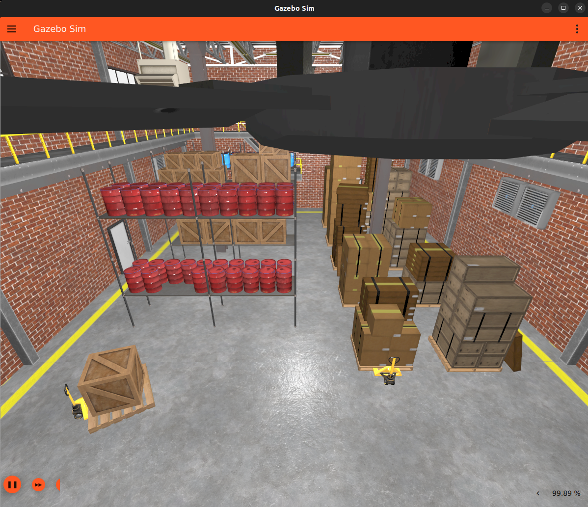

# Dream Worlds Overview

Run the desired simulated world in [gazebo harmonic](https://gazebosim.org/home) by appending `world:=<desired-world-name>` to the simulation launch script.

## Depot World

To use depot world append `world:=depot` to the simulation launch script.

???+ picture "Depot world is a highly graphics intensive world that simulates a small warehouse."

    

## Basic Map World

To use basic map world append `world:=basic_map` to the simulation launch script.

???+ picture "Basic map world is very minimalistic to help users on less capable machines."

    

??? question "How do I add a different world?"

	* It is very easy to add other worlds to dream for use in simulation, there are only a few things to keep in mind:
		1. Make sure the desired [model assets](https://app.gazebosim.org/fuel/models) work correctly in Gazebo Harmonic [(this includes checking the SDF version)](https://github.com/CogniPilot/dream_world/blob/0c66b82914e5536cc8a0511ead9eacf1c025db07/models/Depot/model.sdf#L2)
		2. Add the worlds model assets to `dream_world/models/<model name>`
		3. Create a unique named world sdf file in `dream_world/worlds/`
		4. Make sure the world name stays as [`default`](https://github.com/CogniPilot/dream_world/blob/0c66b82914e5536cc8a0511ead9eacf1c025db07/worlds/depot.sdf#L3) so the sensors can be properly mapped through the ros_gz bridge.
		5. Add all the [sensor plugins and required world defaults](https://github.com/CogniPilot/dream_world/blob/0c66b82914e5536cc8a0511ead9eacf1c025db07/worlds/depot.sdf#L4-L83).
		6. [Include the desired model](https://github.com/CogniPilot/dream_world/blob/0c66b82914e5536cc8a0511ead9eacf1c025db07/worlds/depot.sdf#L85-L89).
		7. Append the worlds unique file name (without .sdf) to the simulation launch script.

