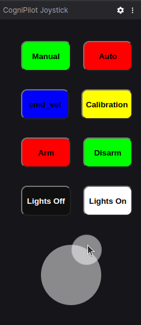

# B3RB Electrode Overview

[Electrode](../../electrode/about.md) can be run with Foxglove or RVIZ 2 backends for the real and [simulated B3RB](./simulation.md). Foxglove is the reccomended and default backend for Electrode.

Electrode uses a Joystick ([virtual](#foxglove-cognipilot-joystick-extension) or [physical](#example-of-using-electrode-with-a-logitech-f310)) to control the B3RB.

## Joy Input

Any compatible `Joy` input can be used to control the platform.

### Joy input message

The `sensor_msgs/Joy` message on topic `/cerebri/in/joy` controls the b3rb, inspect the message to see the field mappings.
``` { .yaml .annotate title="ros2 topic echo /cerebri/in/joy" }
---
header:
  stamp:
    sec: 0
    nanosec: 0
  frame_id: ''
axes:
- 0.0
- 0.0      #(1)
- 0.0
- 0.0      #(2)
buttons:
- 0        #(3)
- 0        #(4)
- 0        #(5)
- 0        #(6)
- 0        #(7)
- 0        #(8)
- 0        #(9)
- 0        #(10)
---
```

1. **Throttle** in <span style="color:green; background-color:darkgray;"> **Manual Mode** </span>.
2. **Steering** in <span style="color:green; background-color:darkgray;"> **Manual Mode** </span>.
3. <span style="color:green; background-color:darkgray;"> **Manual Mode** </span>
4. <span style="color:red; background-color:darkgray;"> **Auto Mode** </span>
5. <span style="color:blue; background-color:darkgray;"> **CMD_VEL Mode** </span>
6. <span style="color:yellow; background-color:darkgray;"> **Calibration Mode** </span>
7. Front Lights On
8. Front Lights Off
9. <span style="color:green;">**Disarm**</span>
10. <span style="color:red;">**Arm**</span>

### Foxglove CogniPilot Joystick extension

???+ tip "Install foxglove-studio and build the foxglove CogniPilot Joystick extension"

    Make sure to have first run the `build_foxglove` script at some point and **follow the prompts**.
    ```bash title="Run build_foxglove script:"
    build_foxglove
    ```

The foxglove CogniPilot Joystick extension allows users to control the B3RB without the need for a physical joystick.
???+ picture "Using the CogniPilot Joystick extension in foxglove."

    Use is simple, click the corresponding buttons to perform their actions and click and drag the smaller circle around for throttle (up/down) and steering (left/right).

    


??? question "Can I still use a physical josytick with foxglove?"

    A physical Joystick can still be used with foxglove but it requires closing the `CogniPilot Joystick` panel that is automatically opened when importing the `b3rb.json` layout and running electrode with `joy:=true`
    ```bash title="Run Electrode with foxglove and physical joystick"
    ros2 launch electrode electrode.launch.py joy:=true
    ```
    

### Example of using electrode with a [Logitech F310](https://www.logitechg.com/en-us/products/gamepads/f310-gamepad.940-000110.html)
??? picture "Logitech F310 button layout."

    

#### Selecting a Mode

* <span style="color:green; background-color:darkgray;"> **A** </span>: Manual Mode
* <span style="color:blue; background-color:darkgray;"> **X** </span>: CMD_VEL Mode (nav2)
* <span style="color:red; background-color:darkgray;"> **B** </span>: Auto Mode (other cmd_vel)
* <span style="color:yellow; background-color:darkgray;"> **Y** </span>: Calibration Mode

#### Arming

* **START**: arm
* **BACK**: disarm

#### Manual Mode

* **Left stick Up/Down**: Throttle
* **Right stick Left/Right**: Steering

#### Front Lights

* **LB**: Front lights on
* **RB**: Front lights off
