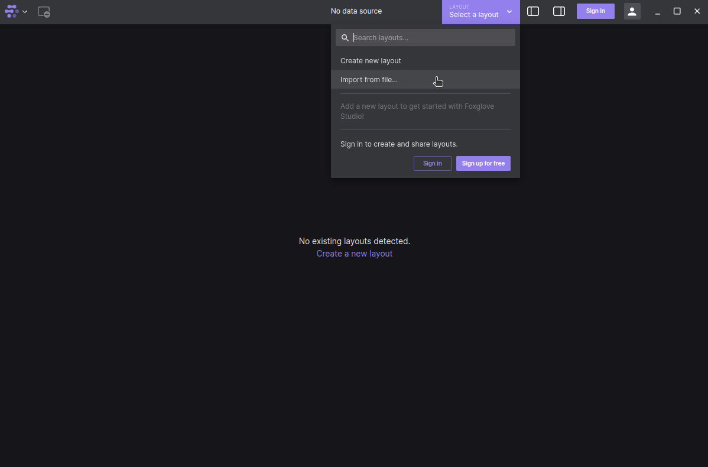
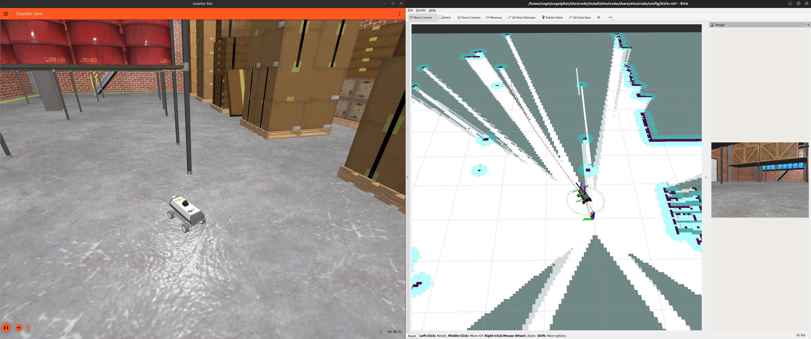

# B3RB Simulation

Simulation uses [gazebo garden](https://gazebosim.org/home) to simulate sensors and physics in the ["dream" worlds](../../dream/worlds/worlds.md) that connects to [Cerebri](../../cerebri/about.md) running on top of the Zephyr RTOS `native_sim`.

## Before running simulation

Before running the simulation for the first time make sure to have first followed the [installation for development computer guide](../../getting_started/install.md). Once at [building the workspace](../../getting_started/install.md#build-the-workspace) make sure to select `1. b3rb` for the platform. This will also build Cerebri for `native_sim` so the section below **["Build Cerebri for `native_sim`"](#build-cerebri-for-native_sim)** can be skipped if the `build_workspace` script was just run. If other images have been built in Cerebri since running the script make sure to follow **["Build Cerebri for `native_sim`"](#build-cerebri-for-native_sim)**. 

## Build Cerebri for `native_sim`

To build [Cerebri for native_sim (posix)](../../cerebri/about.md) make sure the Zephyr RTOS build environment is up to date and that at some point previously the [`build_workspace` script was run for b3rb](../../getting_started/install.md#build-the-workspace).

??? tip "If the `build_workspace` script was just run, the steps in this section can be skipped."

    This section only needs to be run if different images have been built in Cerebri since having run the `build_workspace` script.

```bash title="Update Zephyr RTOS build environment with west:"
cd ~/cognipilot/ws/cerebri
git pull
west update
```

Build the Cerebri for `native_sim`, install and source it so it can be found.
```bash title="Build and install Cerebri for native_sim:"
west build -b native_sim app/b3rb/ -p -t install
source ~/.bashrc
``` 

## Run Electrode

???+ tip "If using the foxglove backend for Electrode."

     Make sure to have first followed instructions to [install foxglove-studio and the foxglove CogniPilot Joystick extension](../../electrode/about.md#install-foxglove-studio-and-the-foxglove-cognipilot-joystick-extension).


To visualize and control the simulated B3RB it is recommended to understand the [key concepts and backend options with Electrode](../../electrode/about.md), the default Electrode backend is foxglove-studio.

### Run Electrode with the [foxglove-studio backend for B3RB](./electrode.md) simulation.
```bash title="Electrode for simulation with foxglove:"
ros2 launch electrode electrode.launch.py sim:=true
```

??? question "Foxglove studio opened, how do I connect it to the simulation?"

    After launching electrode with only passing `sim:=true`
    connect to it on `ws://localhost:8765`
    


??? picture "Example of depot world simulation with electrode running foxglove."

    

??? question "My foxglove studio connected but it's not showing what I would expect it to, how do I load the `b3rb.json` layout file?"

    1. Click the foxglove logo drop down in upper left followed by `Import layout from file...`
    
    2. Click the `b3rb.json` file followed by clicking `Select` by navigating `Home > cognipilot > electrode > src > electrode > foxglove_layouts > b3rb.json`
    
    3. The layout should now be present regardless of foxglove being connected to a websocket data source.
    

### Optionally run Electrode with the [RVIZ 2 backend](./electrode.md) for B3RB simulation.
Electrode can be optionally run with the [RVIZ 2 backend](./electrode.md) for simulation, however, it requires a [physical joystick device](../../electrode/about.md#example-of-using-electrode-with-a-physical-joystick-for-b3rb) for input.
```bash title="Electrode for simulation with RVIZ 2:"
ros2 launch electrode electrode.launch.py rviz2:=true sim:=true
```
??? picture "Example of depot world simulation with electrode running rviz2."

    


## Run B3RB SIL
The default dream world for B3RB is the [basic map world](../../dream/worlds/worlds.md#basic-map-world).
```bash title="Launch simulation with basic map world:"
ros2 launch b3rb_gz_bringup sil.launch.py
```

??? question "My ROS 2 cerebri_bringup node is showing an error and is keeping simulation from running."

    If the simulation launch script is throwing an error about cerebri_bringup make sure that [cerebri is built, installed and sourced properly for `native_sim`](#build-cerebri-for-native_sim).

!!! tip "**If running on a machine with a powerful graphics card optionally run the more graphics intensive [depot world](../../dream/worlds/worlds.md#depot-world).**"

    ```bash title="Launch simulation with depot world:"
    ros2 launch b3rb_gz_bringup sil.launch.py world:=depot
    ```

## Video example of using the simulation
??? video "Example of using simulation with electrode running foxglove."

    <video controls>
      <source src="../videos/b3rb_depot_foxglove.mp4" type="video/mp4">
    </video>

